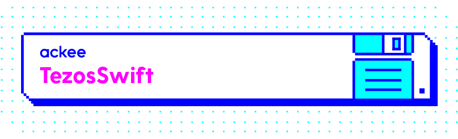

[](http://cocoapods.org/pods/TezosSwift)
[](http://cocoapods.org/pods/TezosSwift)
[](https://github.com/Carthage/Carthage)
[](http://cocoapods.org/pods/TezosSwift)

TezosSwift is a Swift library that is compatible with the [Tezos Blockchain](https://tezos.com). TezosSwift implements communication with the blockchain via the JSON API. The code also supports generating and calling smart contracts if you use the generator from: https://github.com/AckeeCZ/Tezos-iOS-Dev-Kit!

This project is forked from https://github.com/keefertaylor/TezosKit and the resemblance is still quite high. 

## Functionality

TezosSwift provides first class support for the following RPCs:
* Getting account balances
* Getting data about the chain head
* Getting account delegates 
* Generating and restoring wallets 
* Sending transactions between accounts
* Sending multiple operations in a single request
* Setting a delegate
* Registering as a delegate
* **New**: Combine support!
* And more!

The library is extensible allowing client code to easily create additional RPCs and signed operations, as required. 

TezosSwift takes care of complex block chain interactions for you:
* Addresses are revealed automatically, if needed
* Sending multiple operations by passing them in an array

It also parses data and populates the appropriate models, so you can access the data in type-safe way!

## Installation

### CocoaPods
TezosSwift supports installation via CocoaPods. You can depened on TezosSwift by adding the following to your Podfile:

```
pod "TezosSwift"
```

If you want Combine support, you can add:
```
pod "TezosSwift/Combine"
```

## Getting Started

### Create a Network Client

```swift
let publicNodeURL = URL(string: "https://rpc.tezrpc.me")!
let tezosClient = TezosClient(remoteNodeURL: publicNodeURL)
```

### Retrieve Data About the Blockchain

```swift
tezosClient.chainHead { result in
    switch result {
    case .success(let chainHead):
        print(chainHead.chainId)
        print(chainHead.protocol)
    case .failure(let error):
        print("Calling chain head failed with error: \(error)")
    }
}
```

### Retrieve Data About a Contract

```swift
tezosClient.balance(of: "KT1BVAXZQUc4BGo3WTJ7UML6diVaEbe4bLZA", completion: { result in
    switch result {
    case .success(let balance):
        print(balance.humanReadableRepresentation)
    case .failure(let error):
        print("Getting balance failed with error: \(error)")
    }
})
```

### Create a Wallet

```swift
let wallet = Wallet()
print("New wallet mnemonic is: \(wallet.mnemonic)")
```

### Send a Transaction

```swift
tezosClient.send(amount: Tez(1), to: "tz1WRFiK6eGNvP3ioWkWeP6JwDaQjj95opnQ", from: wallet, completion: { result in
    switch result {
    case .success(let transactionHash):
        print(transactionHash)
    case .failure(let error):
        print("Sending Tezos failed with error: \(error)")
    }
})
```

**Note**:
We are using `Tez` and `Mutez` struct representing Tezos and Mutez amounts.

### Send Multiple Transactions at Once

Here's an example of how you can send multiple transactions at once. You 
can easily send Jim and Bob some XTZ in one call:

```swift
let myWallet: Wallet = ...
let jimsAddress: String = tz1...
let bobsAddress: String = tz1...

let amountToSend = TezosBalance("2")!

let sendToJimOperation = TransactionOperation(amount: amountToSend,
                                              source: myWallet,
                                              destination: jimsAddress)
let sendToBobOperation = TransactionOperation(amount: amountToSend,
                                              source: myWallet,
                                              destination: bobsAddress)

let operations = [ sendToJimOperation, sendToBobOperation ]
tezosClient.forgeSignPreapplyAndInjectOperations(operations: operations,
                                                 source: myWallet.address,
                                                 keys: myWallet.keys) { result in
  print("Sent Jim and Bob some XTZ! See: https://tzscan.io/\(result.value!)")
}
```

### Set a Delegate

```swift
let wallet = ...
let originatedAccountAddress = <Some Account Managed By Wallet>
let delegateAddress = ...
tezosClient.delegate(from: originatedAccountAddress,
                     to: delegateAddress,
                     keys: wallet.keys) { result in 
  print("Delegate for \(originatedAccountAddress) set to \(delegateAddress).")
  print("See: https://tzscan.io/\(result.value!)")
}
```

### Michelson Types

Tezos contract types are natively written in Michelson, so there had to be made some compromises to use them in Swift.

One of the major ones is `Pair` - `Tuple` is unfortunately can not conform to `Codable`, and so we decided to parse the nested pairs parameter by parameter, all technicalities aside from left to right.
To make this more clear, let’s see an example:

`parameter (pair (pair (pair string (list int)) (set nat)) bytes)`

This Michelson parameter is then converted, so it is called like this:

```swift
func call(param1: String, param2: [Int], param3: [UInt], param4: Data)
```

## Combine

There are extensions on `TezosClient` that implement Combine behavior - ie
```swift
balance(of: "tezos_address")
```
can also be called like this:
```swift
balancePublisher(of: "tezos_address")
```

This method returns a `Publisher` that you can subscribe to. Yay!

## More

### Fees

The `OperationFees` object encapsulates the fee, gas limit and storage limit to inject an operation onto the blockchain. Every `Operation` object contains a default set of fees. If it is operation like sending parameters to a contract, it will automatically calculate the fees for you! Clients can also pass custom `OperationFees` objects when creating Operations to define their own fees (note they will rewrite even the automatically calculated fees). 

## Contributing

I am happy to accept pull requests. 

## License

MIT
